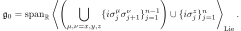
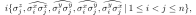
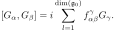

# $\mathfrak{g}$-sim
This repository contains additional data for the $\mathfrak{g}$-sim framework outlined in our manuscript "Lie-algebraic classical simulations for variational quantum computing" ([arXiv:2308.01432](https://arxiv.org/abs/2308.01432)). At present, the following data are provided.

## $\mathfrak{g}_0$ algebra basis
In our manuscript, we make use of the following algebra:



As shown by Kökcu *et al.* ([PhysRevLett.129.070501](https://journals.aps.org/prl/abstract/10.1103/PhysRevLett.129.070501)), a basis of this algebra is given by the set of Pauli strings



where $\widehat{A_iB_j}=A_i \sigma^z_{i+1} \cdots \sigma^z_{j-1} B_j$. We denote these basis operators as $G_\gamma$, where $\gamma\in\{1,\dots,\text{dim}(\mathfrak{g}_0)\}.$ We provide these basis operators for $n\in\{10,20,30,40,50\}$ qubits, in the files `g-sim/basis_n_qubits.csv`. The files are in comma-separated-value (CSV) format, where each line is of the form `gamma,G`, for a (1-indexed) index `gamma`, and a corresponding Pauli string `G`. For example, the line
```
57,IYZZXIIIII
```
indicates that $G_{57}=i(I_1\otimes \sigma_2^y\otimes \sigma_3^z \otimes \sigma_4^z \otimes \sigma_5^x \otimes I_6 \otimes I_7 \otimes I_8 \otimes I_9 \otimes I_{10})$.

## $\mathfrak{g}_0$ structure constants (adjoint representation)
For all basis elements above, we include the corresponding algebraic *structure constants* $f_{\alpha \beta}^\gamma$, where



For each system size $n$ and system size $\gamma$, the non-zero structure factors are provided in `g-sim/adjoint_n_qubits/H_gamma.csv`. They are again reported in CSV format, with each line in the form `alpha,beta,f`, where the first two entries are the algebra indices $\alpha,\beta$ and the last entry is the structure constant. For example, the line
```
50,49,-2.0
```
in `H_2.csv` indicates that $f_{50,49}^2=-2$.